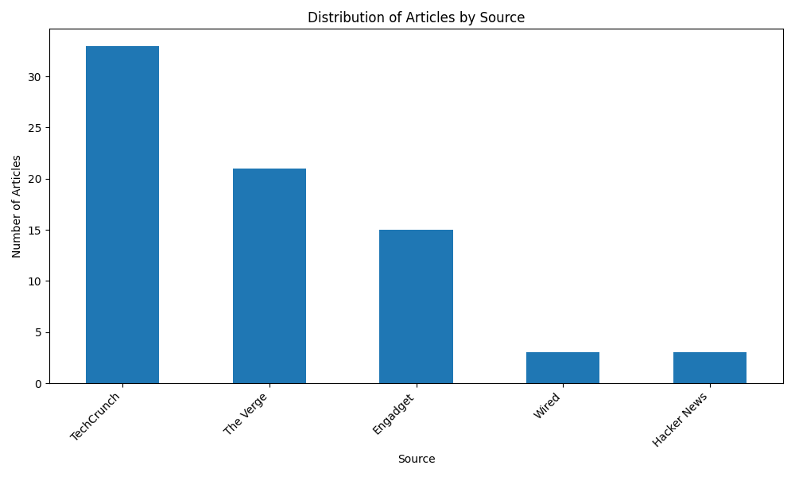
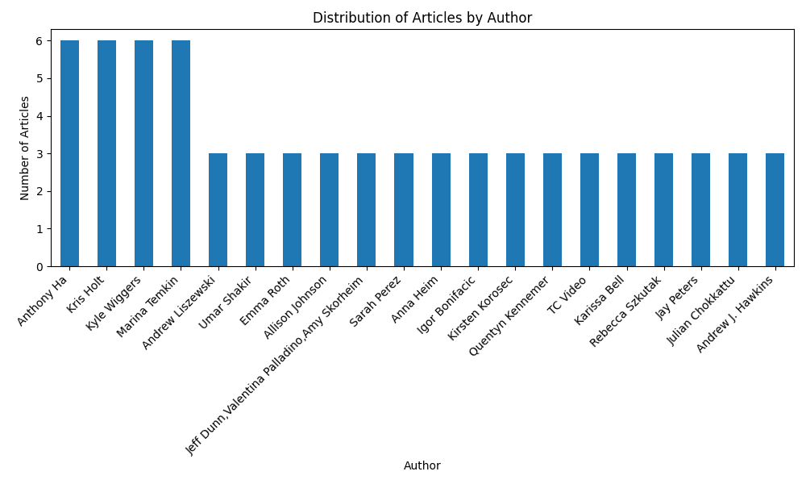

# News-Final-Project

## Problem

Tech enthusiasts often keep up with the latest industry developments by reading blogs and articles from various news outlets. However, these resources are scattered across multiple websites, making it difficult to locate.

## Overview
This project fetches news data from the MediaStack API, processes it, and updates a dataset on Hugging Face. The goal of this dataset is to consolidate technology-related articles from various news sources into a single platform, allowing enthusiasts to quickly and easily find content relevant to their interests.

## Tool(s) to source the data
MediaStack API to obtain data across news outlets

## Power Analysis


## Ethics Statement
This project consolidates technology-related articles from different news articles into a single dataset to facilitate easy access to technology content. The following are the methods used to maintain high ethical standards:
- **Data Privacy**: The data collected and processed in this project is sourced from publicly available news articles via an API. No personal or sensitive data is being collected or stored.
- **Non-Bias**: This data source does not particularly target or favor any specific news outlet. The data is collected from various sources to provide a comprehensive view of technology-related articles.
- **Transparency**: Transparency is maintained in our data collection processing methods. The source of the data is through the MediaStack API and the methods used to process and analyze the data are documented accurately.
- **Accuracy**: The information collected and analysis performed is accurate and reliable. Efforts are made to ensure that data is processed correctly and the generated visualizations are based on accurate data.

## Dataset
The dataset is hosted on the Hugging Face Datasets Hub and can be accessed using the following link: [Tech News Dataset](https://huggingface.co/datasets/adityaraju26/tech-news-data). The columns contained are as follows: **author, title, description, url, source, category, language, country, published_at**.

## Exploratory Data Analysis
Exploratory Data Analysis (EDA) is performed on the dataset to gain insights into the data collected. The analysis done in this project includes the following:
- **Missing Values in Dataset**: A bar chart showing the number of articles from each news source. From seeing this, we can identify that TechCrunch has the most articles in the dataset while Hacker News has the least. This is important to understand so we can assess each outlet and see if we need to add more articles from a specific source.
- **Number of articles containing "AI" in the title or description**: With there being 75 articles in the dataset, it was surprising to see that all 75 articles contain the phrase. I was particularly interested in this since as of recent, AI has been on various social media and news platforms and the insight gained from this operation supports that idea.
- 
- 

## Features
- Fetch news data from MediaStack API
- Process and clean the data
- Update the dataset on Hugging Face Datasets Hub
- Perform exploratory data analysis (EDA) with visualizations

## Requirements
- Python 3.8+
- pandas~=2.0.3
- datasets~=3.1.0
- huggingface-hub~=0.26.2
- pytest~=8.3.3
- matplotlib~=3.7.1

## Installation
1. Clone the repository:
    ```sh
    git clone https://github.com/adityaraju926/News-Final-Project.git
    cd News-Final-Project
    ```

2. Install the required packages:
    ```sh
    pip install -r requirements.txt
    ```

## Usage
1. Set the environment variables:
    ```sh
    export HF_DATASET_REPO=your_dataset_repo
    export HF_ACCESS_TOKEN=your_huggingface_token
    ```

2. Run the main script to fetch and update the dataset:
    ```sh
    python dataset.py
    ```

3. Perform EDA:
    ```sh
    python eda.py
    ```

## Testing
Run the tests using `pytest`:
```sh
pytest